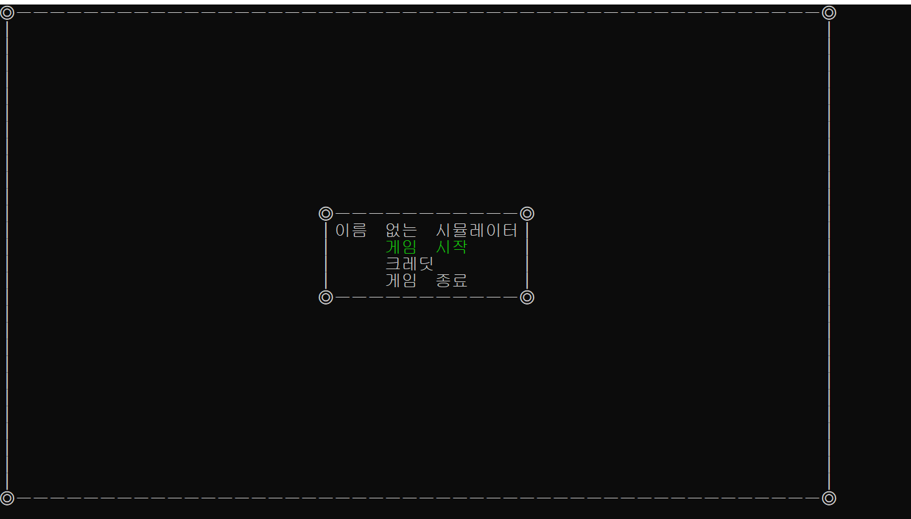
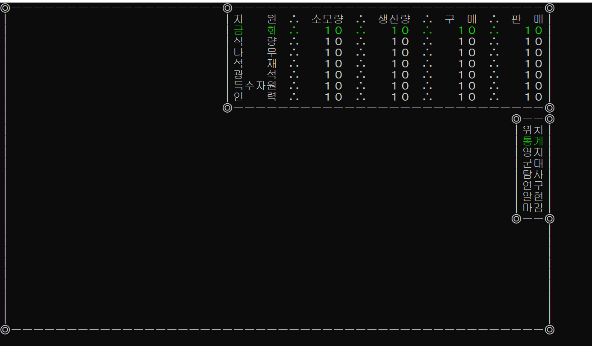
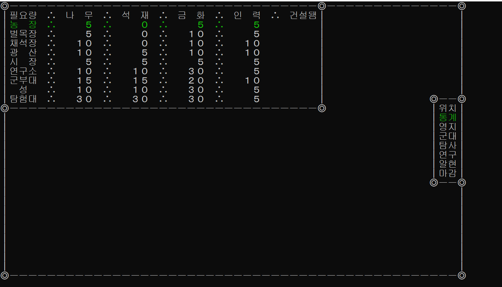
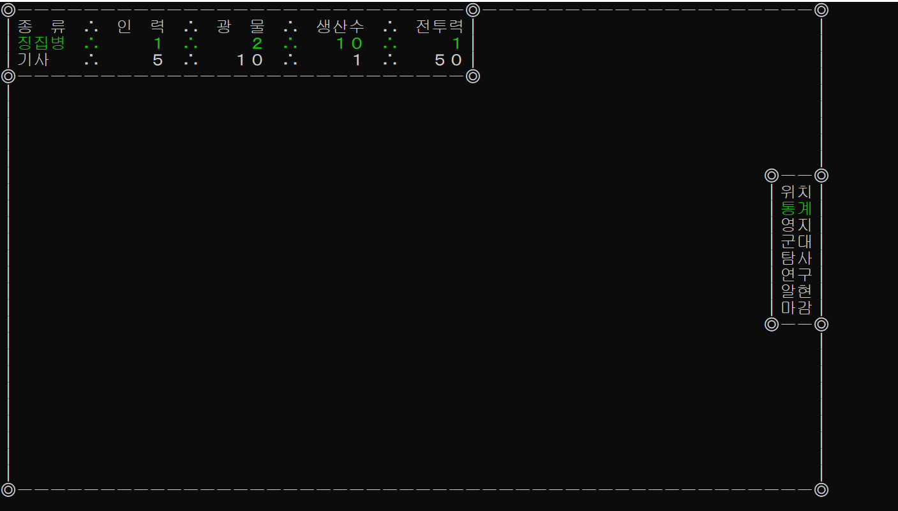
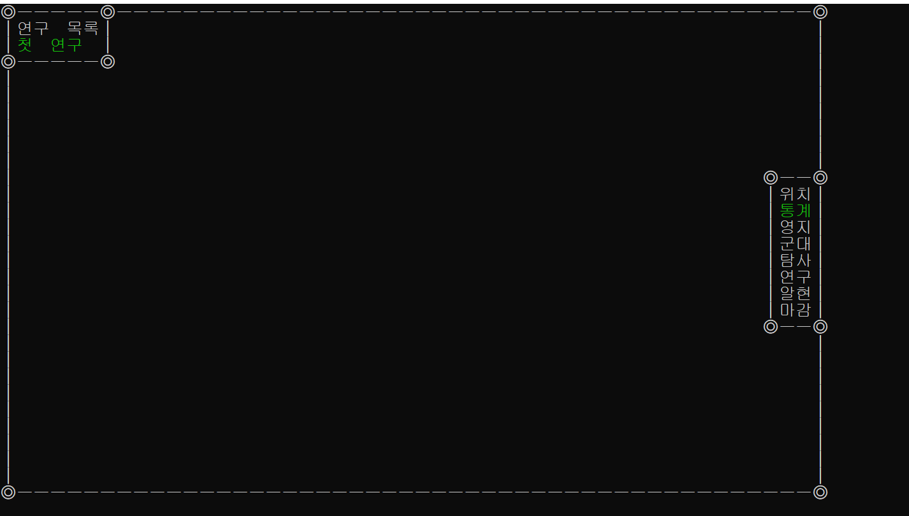

# 미정
- **미완성 프로젝트입니다.**
## 개요
- 게임 방식
- 게임 조작
- 게임 내용
- 게임 화면
- 소감

## 게임 방식
- 시뮬레이터 

## 게임 조작
- 방향키 = 위치 조작
  - 녹색 글씨가 선택된 대상입니다.
- Tap = 선택창 전환
- Enter = 선택

## 게임 내용
- 영주가 되어 영지를 발전시켜야합니다.
- 영지 발전시켜 자원을 모으고, 군대를 키워서 탐험을 보내며, 연구를 통해 더욱 발전해야합니다.

## 게임 화면
- 메인 화면

- 통계 화면

- 영지 화면

- 군대 화면

- 탐험 화면
  - 미구현 상태

- 연구 화면

- 알현 화면
  - 미구현 상태

- 마감
  - 하루를 종료합니다 (미구현)

## 소감
- 생각보다 큰규모를 설계를 하였으며, 시간 관리에 실패하여, 기한 내에 완성하는 것은 실패하였습니다.
- 기한 내에 최소한의 동작을 위해 하드코딩한 부분도 많았습니다.
- 하지만, 객체지향적 설계를 적극적으로 실행에 움겼으며, 부족하지만, 만족할 만한 성장이 있었습니다.
